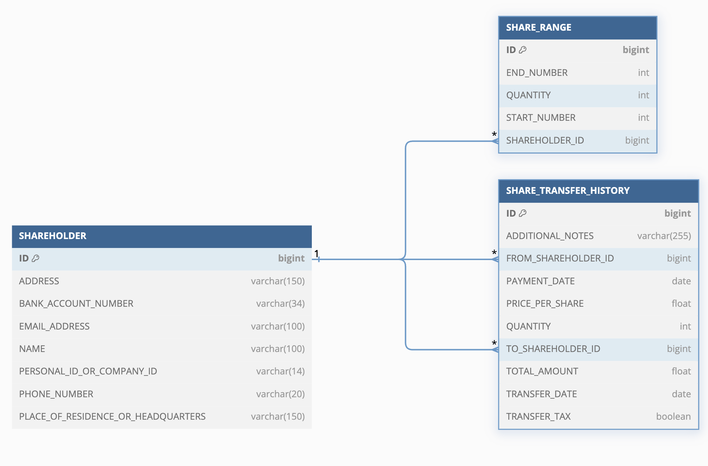

# Shareholders App Backend -ohjelman tiivistelmä

`shareholders_app_backend` on monipuolinen sovellus, joka on toteutettu Spring Bootilla ja Reactilla. Se hallinnoi osakkeenomistajien ja osakkeiden tietoja RESTful API:n kautta.

## Sovelluksessa voit:

1. **Lisätä ja päivittää osakkeenomistajia ja osakkeita.**
2. **Hakea osakkeenomistajien ja osakkeiden tietoja.**
3. **Päivittää ja poistaa tietoja tarpeen mukaan.**
4. **Siirtää osakkeita osakkeenomistajien välillä ja hallita siirtohistoriaa.**
5. **Hakea siirtohistoriaa ja hallita varainsiirtoveroa.**

## Sisällysluettelo

1. [Entity-Relationship Diagram (ERD)](#entity-relationship-diagram-erd)
2. [Päätoiminnot](#päätoiminnot)
   - [Osakkeenomistajat](#1-osakkeenomistajat)
   - [Osakkeet](#2-osakkeet)
   - [Siirto](#3-siirto)
   - [Osakehistoria](#4-osakehistoria)
3. [Validointi](#validointi)
   - [Osakkeenomistajat](#osakkeenomistajat)
   - [Osakkeet](#osakkeet)
   - [Siirto](#siirto)
4. [Poikkeusten käsittely](#poikkeusten-käsittely)
5. [Kohderyhmät](#kohderyhmät)

---

# Entity-Relationship Diagram (ERD)

## Entities

### SHAREHOLDER

- **Attributes**:
  - **ID** (PK) - BIGINT
  - **ADDRESS** - VARCHAR(150)
  - **BANK_ACCOUNT_NUMBER** - VARCHAR(34)
  - **EMAIL_ADDRESS** - VARCHAR(100)
  - **NAME** - VARCHAR(100)
  - **PERSONAL_ID_OR_COMPANY_ID** - VARCHAR(14)
  - **PHONE_NUMBER** - VARCHAR(20)
  - **PLACE_OF_RESIDENCE_OR_HEADQUARTERS** - VARCHAR(150)

---

### SHARE_RANGE

- **Attributes**:
  - **ID** (PK) - BIGINT
  - **END_NUMBER** - INTEGER
  - **QUANTITY** - INTEGER
  - **START_NUMBER** - INTEGER
  - **SHAREHOLDER_ID** (FK) - BIGINT [references SHAREHOLDER(ID)]

---

### SHARE_TRANSFER_HISTORY

- **Attributes**:
  - **ID** (PK) - BIGINT
  - **ADDITIONAL_NOTES** - VARCHAR(255)
  - **FROM_SHAREHOLDER_ID** (FK) - BIGINT [references SHAREHOLDER(ID)]
  - **PAYMENT_DATE** - DATE
  - **PRICE_PER_SHARE** - DOUBLE
  - **QUANTITY** - INTEGER
  - **TO_SHAREHOLDER_ID** (FK) - BIGINT [references SHAREHOLDER(ID)]
  - **TOTAL_AMOUNT** - DOUBLE
  - **TRANSFER_DATE** - DATE
  - **TRANSFER_TAX** - BOOLEAN

---

## Relationships

- **SHAREHOLDER (1) --- (M) SHARE_RANGE**
  - One SHAREHOLDER can own multiple SHARE_RANGE entries (one-to-many).
- **SHAREHOLDER (1) --- (M) SHARE_TRANSFER_HISTORY (as Sender)**
  - One SHAREHOLDER can be involved in multiple SHARE_TRANSFER_HISTORY entries as a sender (FROM_SHAREHOLDER_ID).
- **SHAREHOLDER (1) --- (M) SHARE_TRANSFER_HISTORY (as Recipient)**
  - One SHAREHOLDER can be involved in multiple SHARE_TRANSFER_HISTORY entries as a recipient (TO_SHAREHOLDER_ID).
- **SHARE_RANGE (1) --- (M) SHARE_TRANSFER_HISTORY (optional)**
  - One SHARE_RANGE can be related to multiple SHARE_TRANSFER_HISTORY entries (one-to-many, optional relationship).

## Päätoiminnot

### 1. Osakkeenomistajat

**Perustoiminnot:**

- **Luo:** Uuden osakkeenomistajan lisääminen.
- **Hae:** Olemassa olevien osakkeenomistajien hakeminen.
- **Päivitä:** Osakkeenomistajan tietojen päivittäminen.
- **Poista:** Osakkeenomistajan poistaminen.

**Osakkeenomistajan tiedot:**

- **Nimi ja tunnus:** Osakkeenomistajan tai yrityksen nimi sekä henkilötunnus tai Y-tunnus.
- **Yhteystiedot:** Osoite, sähköposti, puhelinnumero ja pankkitilitiedot.
- **Osakkeet:** Osakkeiden määrä, alku- ja loppunumerot.
- **Omistus:** Yhteismäärä ja prosentuaalinen osuus omistetuista osakkeista.

**Esimerkki osakkeenomistajasta:**

- **Osakkeenomistaja 1:**
  - Nimi: **PHZ Full Stack Oy**
  - Henkilötunnus tai Y-tunnus: **2765147-9**
  - Osoite: **Katu 1, Helsinki**
  - Sähköposti: **info@phzfullstack.fi**
  - Puhelinnumero: **(+358) 40 123 4567**
  - Pankkitilitiedot: **FI1234567890123456**
  - Yhteensä osakkeita: **3,000,000**
  - Omistusprosentti: **60,00%**

### 2. Osakkeet

**Perustoiminnot:**

- **Luo:** Uuden osakkeen luominen.
- **Hae:** Olemassa olevien osakkeiden hakeminen.
- **Siirrä:** Osakkeiden siirtäminen osakkeenomistajien välillä.

**Osakkeiden tiedot:**

- **ID:** Osakkeen yksilöivä tunnus.
- **Määrä:** Omistettujen osakkeiden määrä.
- **Alkunumero:** Ensimmäinen osakkeen numero.
- **Loppunumero:** Viimeinen osakkeen numero.
- **Osakkeenomistajan ID:** Osakkeenomistaja, jolle osakkeet kuuluvat.

**Esimerkkejä osakkeista:**

- **ID 1:** Määrä **1,000,000** (alkunumero **1**, loppunumero **1,000,000**) - Osakkeenomistaja **1**
- **ID 2:** Määrä **500,000** (alkunumero **1,000,001**, loppunumero **1,500,000**) - Osakkeenomistaja **2**
- **ID 3:** Määrä **250,000** (alkunumero **1,500,001**, loppunumero **1,750,000**) - Osakkeenomistaja **2**
- **ID 4:** Määrä **100,000** (alkunumero **1,750,001**, loppunumero **1,850,000**) - Osakkeenomistaja **3**
- **ID 5:** Määrä **50,000** (alkunumero **1,850,001**, loppunumero **1,900,000**) - Osakkeenomistaja **3**

### 3. Siirto

**Perustoiminnot:**

- **Osakkeen siirto:** Osakkeiden siirto osakkeenomistajien välillä.

**Siirron tiedot:**

- **Sääntöpäivä:** Siirron toteutuspäivämäärä, jolloin osakkeet virallisesti siirtyvät luovuttajalta saajalle.
- **Maksupvm:** Maksupäivämäärä, joka voi olla sama kuin sääntöpäivä tai muu sovittu päivä. Kenttä voidaan jättää tyhjäksi ja lisätä myöhemmin.
- **Luovuttaja (Myyjä):** Luovuttaja, joka siirtää osakkeet.
- **Saaja (Ostaja):** Saaja, joka vastaanottaa osakkeet.
- **Kpl:** Siirrettävien osakkeiden määrä.
- **Hinta per osake:** Yhden osakkeen hinta.
- **Varainsiirtovero:** Osake-siirrosta perittävä vero. Ilmoita **true**, jos vero peritään, tai **false**, jos vero ei peritä. Tämä tieto tallennetaan siirtohistoriaan.
- **Total:** Lasketaan automaattisesti siirron bruttosumma ennen veroja.
- **Muut tiedot:** Lisätiedot tai huomautukset.

### 4. Osakehistoria

**Perustoiminnot:**

- **Hae:** Aikaisempien siirtojen tarkastelu.
- **Päivitä:** Maksupäivämäärän päivittäminen.

**Osakehistorian tiedot:**

- Siirron ID, Sääntöpäivä, Maksupvm, Luovuttaja (Myyjä), Saaja (Ostaja), Varainsiirtovero, Kpl, Hinta per osake, Total, Kommentit

## Validointi

### Osakkeenomistajat

- **Vaaditut kentät:** Ei tyhjää.
- **Kenttien pituudet:** Minimimaksimipituudet määritelty `@Size`-annotaatiolla.
- **Muoto validoinnit:**
  1. **Nimi, Osoite, Asuinpaikka:** Merkit: A–Z, a–z, ä, ö, å, numerot, välilyönnit, erikoismerkit (,.'-). Max. 150 merkkiä.
  2. **Hetu / Y-tunnus:** Muoto "YYMMDD-XXXX" (henkilötunnus) tai "XXXXXXX-X" (y-tunnus). Max. 14 merkkiä.
  3. **Sähköpostiosoite:** Oikea sähköpostimuoto (esim. käyttäjänimi@domain.com). Max. 100 merkkiä.
  4. **Puhelinnumero:** Muoto (+358) XX XXX XXX. Max. 20 merkkiä.
  5. **Pankkitili:** IBAN-tilinumerot EU-standardin mukaan. Max. 34 merkkiä.

### Osakkeet

- **ID ja määrä:** Positiivisia lukuja, ID ei tyhjää.
- **Alku- ja loppunumerot:** Oikeanmuotoiset, loppunumero ≥ alkuunumeron.

### Siirto

- **Vaaditut kentät:** Yksilöivä tunnus, päivämäärät, luovuttaja ja saaja: ei tyhjää.
- **Kpl ja hinta:** Positiivisia lukuja.

## Poikkeusten käsittely

- **Virheilmoitukset:** Selkeät syyt validointivirheille.

## Kohderyhmät

- **Osakeyhtiöt:** Erityisen hyödyllinen osakeyhtiöille osakkeenomistajatietojen ja -omistusten hallintaan.
- **Taloustoimistot:** Tarjoaa asiakkaille ajankohtaisia tietoja osakeomistuksista ja siirroista.
- **Sijoittajat:** Mahdollistaa omistusten hallinnan ja siirtohistorian seuraamisen.
- **Kehittäjät:** RESTful API:n kautta integraatioiden ja sovellusten kehittäminen osakkeenomistajatietojen hyödyntämiseksi.
